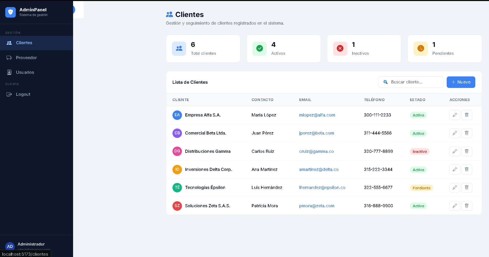

# Panel Administrativo — React + Vite

Panel administrativo web desarrollado con React 18 y Vite como parte de un ejercicio práctico del curso de Ingeniería de Sistemas e Informática. La aplicación implementa navegación tipo Single Page Application (SPA) usando react-router-dom, con rutas definidas para las secciones de Clientes, Proveedor, Usuarios y Logout, sin recarga de página gracias al uso de NavLink y BrowserRouter.

La interfaz cuenta con una barra lateral fija (sidebar) que incluye el logo del sistema, los enlaces de navegación con resaltado de sección activa, y la información del usuario autenticado. Cada sección presenta tarjetas de estadísticas y una tabla de datos con buscador en tiempo real. Los estilos fueron implementados con Bootstrap 5 y Bootstrap Icons, complementados con CSS personalizado para lograr un diseño limpio y profesional estilo panel de gestión empresarial.

---

## Captura de pantalla



---

## Tecnologías utilizadas

| Herramienta | Versión | Uso |
|---|---|---|
| React | 18.3 | Framework UI |
| Vite | 5.4 | Bundler / Dev server |
| react-router-dom | 6.26 | Navegación SPA |
| Bootstrap | 5.3 | Estilos y componentes |
| Bootstrap Icons | 1.11 | Iconografía |

---

## Pasos seguidos para desarrollar el proyecto

**1. Inicialización del proyecto**

Se creó el proyecto usando Vite con la plantilla de React mediante el comando `npm create vite@latest`. Se instalaron las dependencias base con `npm install` y se agregaron manualmente `react-router-dom`, `bootstrap` y `bootstrap-icons`.

**2. Configuración de Bootstrap**

Se importó Bootstrap (CSS y JS) y Bootstrap Icons directamente en `main.jsx` para que estuviera disponible en toda la aplicación sin necesidad de importarlo en cada componente.

**3. Estructura de carpetas**

Se organizó el proyecto en dos carpetas dentro de `src`: `components/` para el Navbar reutilizable y `pages/` para cada vista del panel (Clientes, Proveedor, Usuarios, Logout).

**4. Sistema de navegación**

Se configuró `BrowserRouter` en `App.jsx` como contenedor principal. Se definieron las rutas con `Routes` y `Route`, incluyendo una redirección automática de `/` hacia `/clientes`. En el componente `Navbar.jsx` se usó `NavLink` para los enlaces, lo que permite resaltar automáticamente la sección activa sin necesidad de lógica adicional.

**5. Diseño del Navbar**

Se implementó una barra lateral fija (sidebar) con Bootstrap y CSS personalizado, que incluye el logo del sistema, la lista de navegación con íconos, separación por secciones y los datos del usuario en la parte inferior. Se agregó también una barra superior (topbar) con el título dinámico de la sección actual.

**6. Vistas del panel**

Cada página incluye un encabezado con título, tarjetas de estadísticas relevantes a la sección, y una tabla con datos de ejemplo. Se implementó un buscador en tiempo real usando el hook `useState` de React que filtra los registros mientras el usuario escribe.

**7. Estilos y acabado visual**

Se creó un archivo `index.css` con variables CSS personalizadas para colores, dimensiones y fuentes. Se usó la fuente Inter de Google Fonts y se definieron clases propias para las tarjetas, badges de estado, botones y avatares de tabla, complementando las clases de Bootstrap.

---

## Estructura del proyecto

```
admin-panel/
├── index.html
├── vite.config.js
├── package.json
├── README.md
└── src/
    ├── main.jsx              ← Punto de entrada, importa Bootstrap
    ├── App.jsx               ← BrowserRouter + Routes
    ├── index.css             ← Estilos globales del panel
    ├── components/
    │   └── Navbar.jsx        ← Sidebar + TopBar con NavLink
    └── pages/
        ├── Clientes.jsx      ← Vista de clientes
        ├── Proveedor.jsx     ← Vista de proveedores
        ├── Usuarios.jsx      ← Vista de usuarios
        └── Logout.jsx        ← Vista de cierre de sesión
```

---

## Instalación y ejecución

### Requisitos previos
- Node.js v18 o superior
- npm v9 o superior

### Pasos

```bash
# 1. Clona el repositorio
git clone https://github.com/TU_USUARIO/panel-administrativo-react.git

# 2. Entra a la carpeta
cd panel-administrativo-react

# 3. Instala las dependencias
npm install

# 4. Ejecuta el servidor de desarrollo
npm run dev
```

Abre http://localhost:5173 en tu navegador.

---

## Rutas del sistema

| Ruta | Componente | Descripción |
|---|---|---|
| `/` | — | Redirige automáticamente a `/clientes` |
| `/clientes` | `Clientes.jsx` | Listado de clientes con búsqueda |
| `/proveedor` | `Proveedor.jsx` | Listado de proveedores con categorías |
| `/usuarios` | `Usuarios.jsx` | Gestión de usuarios y roles |
| `/logout` | `Logout.jsx` | Confirmación de cierre de sesión |

---

## Autor

Desarrollado para el Taller de Panel Administrativo Web con React JS  
Docente: Carlos Adolfo Beltrán Castro  
Escuela de Ingeniería de Sistemas e Informática — I Semestre 2025
